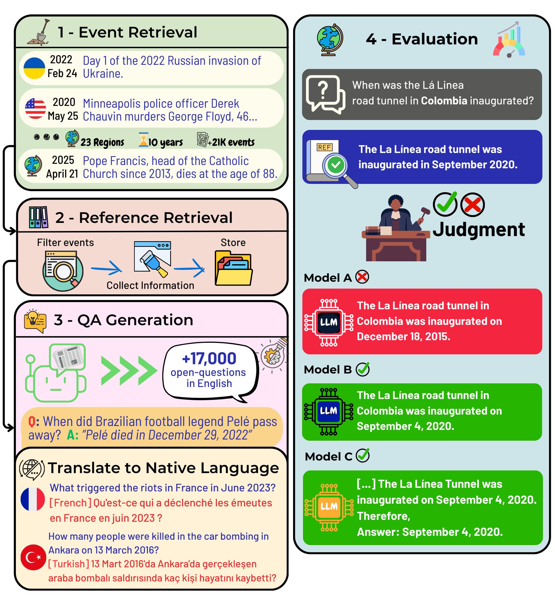

# TiEBe - Timely Events Benchmark

This is the official repository for the paper "TiEBe: Tracking language model Recall of Notable Worldwide Events Through Time".

Our dataset is available here in this repository (under the `data` folder). And it is also available on Hugging Face [here](https://huggingface.co/datasets/TimelyEventsBenchmark/TiEBe).

## About 




As the knowledge landscape evolves and large language models become increasingly widespread, there is a growing need to keep these models updated with current events. While existing benchmarks assess general factual recall, few studies explore how LLMs retain knowledge over time or across different regions. To address these gaps, we present the Timely Events Benchmark—a dataset of over 17,000 question–answer pairs centered on significant global and regional events, covering over 10 years of events, 23 regions, and 13 languages. TiEBe draws from structured retrospective data on Wikipedia, allowing for continuous updates and enabling the evaluation of LLMs’ understanding of recent developments worldwide. Our results reveal notable geographic disparities in factual recall, emphasizing the need for more balanced global representation in LLM training. In addition, we examine the impact of language on factual recall by posing questions in the native language of the region where each event occurred, uncovering substantial performance gaps for low-resource languages.

Tiebe covers the following regions:

- World
- Argentina
- Australia
- Brazil
- Canada
- China
- Colombia
- Ethiopia
- France
- Germany
- India
- Indonesia
- Mexico
- New Zealand
- Nigeria
- Papua New Guinea
- Portugal
- Russia
- the Democratic Republic of the Congo
- the United Kingdom
- the United States
- Turkey
- Ukraine

## Explore the Potential Events Data from TiEBe
Explore the TiEBe potential events data worldwide acessing:
- [Worldmap](static/tiebe_potential_events_data.html)

The link provides access to the dataset in an interactive format.

## Data

Our dataset in this repository is provided in the `data` folder in a collection of json files. You will find two folders:
- `english`: contains the dataset with the questions and answers in English.
- `translated`: contains the dataset with the questions and answers in the native language of the region where the event occurred. Note that countries whose main language is english are not included here.

Each file contains a list of events, each with the following format:
```
{
   "year":"2018",
   "month":"02",
   "event_desc":"The British Columbia Liberal Party leadership election resulted in Andrew Wilkinson being chosen as the new leader of the British Columbia Liberal Party",
   "text":"...",
   "question":"Who was chosen as the new leader of the British Columbia Liberal Party in February 2018?",
   "answer":"Andrew Wilkinson was chosen as the new leader of the British Columbia Liberal Party in February 2018.",
   "region":"Canada",
}
```

## Dataset Generation

The repository includes all the steps necessary to either replicate the current dataset or generate a new one ( with more recent events or maybe for other regions). The pipeline contains three steps:

- Retrieve events from Wikipedia retrospective pages (event_retrieval folder)
- Retrieve events references (reference_retrieval folder)
- Generate questions based on the events and references (question_generation folder)

Additionally, you may want to translate the dataset to other languages,you can check the translate_questions folder for the scripts used to translate the questions to the native language of the region where the event occurred.

## Evaluation

The evaluation consist on two parts:


- Generate answers with the desired model, for the desired subset of TiEBe (answer_generation folder)
- Evaluate the answers with a model as judge (model_evaluation folder)

## Citation

If you use this dataset, please cite the following paper:

```
Coming soon
```

